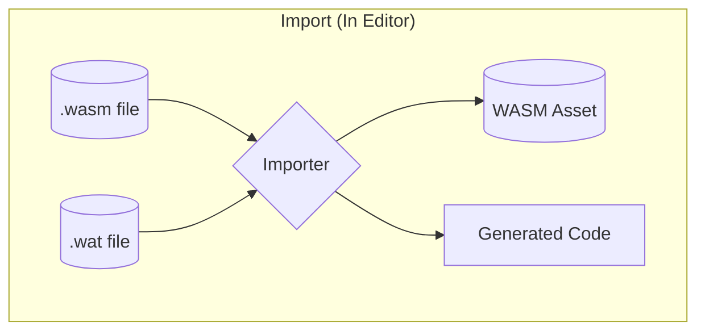
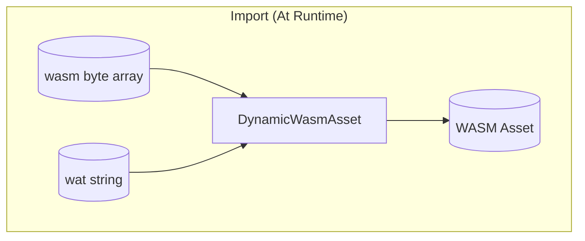
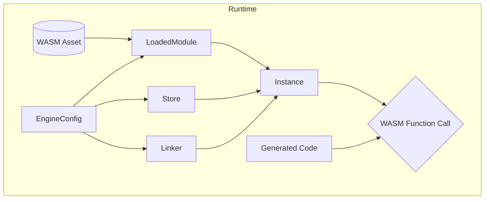

There are several stages to go through in the process of taking a `.wasm` file and loading it into executable code. This document explains the stages at a high level.

## Importing

### In Editor

Wasmbox detects `.wasm` and `.wat` files in your project and [imports](../reference/editor/import.md) them to create a [`WASM Asset`](../reference/code/wasmasset.md) and [generated C# code](../reference/code/codegeneration.md).



### At Runtime

It is possible to load wasm or wat at runtime, without importing it in the editor, by using [`DynamicWasmAsset`](../reference/code/dynamicwasmasset.md) or even a custom implementation of [`IWasmAsset`](../reference/code/iwasmasset.md). All of these options produce something that can be used in the same way as an editor imported [`WASM Asset`](../reference/code/wasmasset.md).

:::tip

Runtime loading does not generate wrapper code.

:::



## Loading

At runtime a WASM Asset must be loaded and configured before it can be called. This process is quite complicated, but Wasmbox includes helpers such as the [`SimpleWasmMonoBehaviour`](../reference/code/simplewasmmonobehaviour.md) which handle most of the steps for you.

1. An [`EngineConfig`](../reference/code/engineconfig.md) configures how the code will be compiled.
2. The [`EngineConfig`](../reference/code/engineconfig.md) is used to compile the [`WASM Asset`](../reference/code/wasmasset.md) into a [`LoadedModule`](../reference/code/loadedmodule.md).
3. A [`Store`](../reference/code/wasmtime/store.md) is created from the [`EngineConfig`](../reference/code/engineconfig.md), to store all state.
4. A [`Linker`](../reference/code/wasmtime/linker.md) is created from the [`EngineConfig`](../reference/code/engineconfig.md), to set what the WASM code can access.
5. [`Store`](../reference/code/wasmtime/store.md), [`Linker`](../reference/code/wasmtime/linker.md) & [`LoadedModule`](../reference/code/loadedmodule.md) are used to create an [`Instance`](../reference/code/wasmtime/instance.md).
6. Functions can be called on the [`Instance`](../reference/code/wasmtime/instance.md).
    - [Generated C# code](../reference/code/codegeneration.md) can be used to make this easier.



## Glossary

### LoadedModule

A [`LoadedModule`](../reference/code/loadedmodule.md) compiles the WASM code stored in a [`WASM Asset`](../reference/code/wasmasset.md) into machine code that can be run on this machine. This process can take a lot of time (100ms or more) the first time it is done, but after that it is cached and should be nearly instantaneous.

:::tip

The editor importer can [precompile](../reference/editor/import.md#4-compilation) WASM code in the editor, which significantly speeds up loading at runtime.

:::

### Store

A WASM [`Instance`](../reference/code/wasmtime/instance.md) has no state (i.e. memory), instead it is all contained within the [`Store`](../reference/code/wasmtime/store.md). A [`Store`](../reference/code/wasmtime/store.md) may be shared between multiple [`Instances`](../reference/code/wasmtime/instance.md).

### Linker

By default WASM execution is completely "sandboxed", executing WASM code cannot access anything outside of the box. This makes it safe to run malicious code, and easy to ensure [determinism](../advanced/determinism.md). The [`Linker`](../reference/code/wasmtime/linker.md) allows you to expose certain C# methods to WASM code, allowing it to call those methods. For example [WASI](./wasi.md) features.

```clike
int Add(int a, int b)
{
    return a + b;
}

// Allow WASM to call `Add` as `myfunctions::add`
linker.DefineFunction("myfunctions", "add", Add);
```

### Instance

An [`Instance`](../reference/code/wasmtime/instance.md) is the final step which allows you to call WASM code.

```clike
var add = instance.GetFunction<int, int, int>("Add");
var result = add(1, 2);
Debug.Assert(result == 3);
```

### Generated Code

An [`Instance`](../reference/code/wasmtime/instance.md) is a low level API that is often not very convenient to use directly. The Wasmbox editor importer can [generate code](../reference/editor/import.md#6-code-generation) which "wraps" an [`Instance`](../reference/code/wasmtime/instance.md) and makes it much more convenient (and efficient) to use.

```clike
using (var wrapper = new GeneratedWrapper(instance, store))
{
    var result = wrapper.Add(1, 2);
    Debug.Assert(result == 3);
}
```