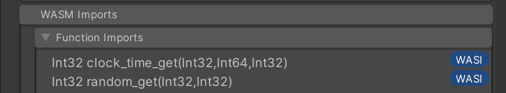

import Tabs from '@theme/Tabs';
import TabItem from '@theme/TabItem';

WASI stands for **WebAssembly System Interface**. It's an API that provides access to several operating-system-like features, including filesystems, clocks, and random numbers. Wasmbox provides implementations of most WASI functions (see `Assets\Plugins\PlaceholderSoftware\Wasmbox\Core\WASI\`).

WASI is a way to provide _controlled_ access to certain system resources. For example the virtual file system implemented by Wasmbox can provide in-memory files and folders which are never saved as well as map real files/folders into the virtual files/folders, this allows you to carefully control exactly what can be accessed through WASM code.

:::caution

WASM execution is normally completely [deterministic](../advanced/determinism.md) - running the same code with the same arguments will produce the same result every time.

Adding WASI features can make execution non-deterministic since it provides access to external resources which are not deterministic (e.g. a clock, which returns a different time every time you read it).

:::

WASM Assets which import a WASI function will show a `WASI` indicator next to the functions. Hovering over the indicator will show which WASI feature is required to supply this import, clicking the indicator will bring you to this this documentation page. All WASI features are interfaces which you may implement yourself, or you can use one of the built in implementations.



<Tabs queryString="wasi-feature">

<TabItem value="ivirtualrandomsource" label="Random Numbers">

Random number generation is provided by an implementation of [`IVirtualRandomSource`](../reference/code/WASI/random.md).

```clike
var rng = new CryptoRandomSource();
linker.Add(rng);
```

</TabItem>

<TabItem value="ivirtualprocess" label="Process">

Functions which would normally be associated with an OS "Process" are provided by an implementation of [`IVirtualProcess`](../reference/code/WASI/process.md).

```clike
var proc = new VirtualProcess(OnExit);
linker.Add(proc);

void OnExit(uint code)
{
    Debug.Log("Process exited with code: " + code);
}
```

</TabItem>

<TabItem value="ivirtualfilesystem" label="File System">

Functions which provide access to the filesystem are provided by an implementation of [`IVirtualFileSystem`](../reference/code/WASI/filesystem.md). The default implementation provides an entire "virtual filesystem" which can have a mix of real files/folders with fully virtual files/folders which are stored in memory.

```clike
// Use a "VirtualFileSystemBuilder" to define a fake file system entirely in memory
var builder = new VirtualFileSystemBuilder()
    .WithVirtualRoot(root => {
        root.CreateVirtualDirectory("A")
            .CreateVirtualDirectory("B", dir => {
                dir.CreateInMemoryFile("File.txt");
            })
    });

linker.Add(builder.Build());
```

</TabItem>

<TabItem value="ivirtualenvironment" label="Environment">

Functions which would normally be associated with an OS "Environment" are provided by an implementation of [`IVirtualEnvironment`](../reference/code/WASI/environment.md).

```clike
var env = new VirtualEnvironment()
    .PassthroughEnvironmentVariables()                      // Add all of the real environment variables
    .SetEnvironmentVariable("foo", "bar")                   // Create a variable named "foo" with value "bar"
    .SetArgs("--foo", "--bar", "bash", "-b", "-a", "-z"));  // Set the WASM process arguments

linker.Add(env);
```

</TabItem>

<TabItem value="ivirtualclock" label="Clock">

Functions which get the current system time are provided by an implementation of [`IVirtualClock`](../reference/code/WASI/clock.md). A `RealtimeClock` provides access to the real system time (with an optional offset). A `ManualClock` provides access to a specific time which only advances when `clock.Tick()` is called.

```clike
var clock = new RealtimeClock();
linker.Add(clock);
```

</TabItem>

<TabItem value="unknown" label="Unknown Feature">

Not all WASI functions are supported by the built in Wasmbox WASI features. Please contacts us on [Discord](https://discord.gg/3RtDa2M9Bx) or on the [Issue Tracker](https://github.com/Placeholder-Software/wasmbox/issues) about the specific feature you need.

</TabItem>

</Tabs>

---