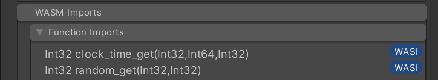

When a `*.wasm` or `*.wat` file is [imported](../editor/import.md) the option `Generate C# Wrapper Code` can be enabled to automatically generate a C# script which "wraps" the WASM module. This wrapper code handles most of the "low level" details of interacting with an instantiated WASM module.

:::caution

The generated code should not be edited - it may be regenerated at any time which will overwrite any other changes made to the file.

:::

## Job Safety

All autogenerated wrapper code is safe to use in the Unity [Job System](https://docs.unity3d.com/Manual/JobSystem.html), this allows WASM execution to be moved off the main thread.

A WASM instance may only be accessed by one thread at a time (even for read-only operations), therefore the wrapper can only be used within _one_ job at a time. The Unity [Safety System](https://docs.unity3d.com/Manual/JobSystemSafetySystem.html) is used to ensure this constraint is not violated.

For more information see [this tutorial](../../basics/jobs.md) on multithreaded jobs.

## WebAssembly System Interface (WASI)

WebAssembly System Interface ([WASI](../../basics/wasi.md)) is a set of APIs which allow access to system resources (such as the filesystem) in a tightly controlled way. If a WASM asset imports any functions which are part of the WASI spec they will be marked in the inspector:



These functions must be defined in the [`Linker`](./wasmtime/linker.md) before the module can be used. Wasmbox provides implementations of most WASI functions ([see documentation here](/category/wasi)). Hovering over the `WASI` marker in the editor will tell you which WASI implementation is required.

## Optional Features

The [importer](../editor/import.md#6-code-generation) includes several optional features which slightly change how the code is generated.

### Addressable Loading

If this option is enabled the wrapper code will include a static `CreateAsync` method which loads the asset (using the Unity [Addressable Asset System](https://docs.unity3d.com/Packages/com.unity.addressables@1.21/manual/index.html)), instantiates it and returns a wrapper object. Using this method no asset references are required in your script, instead everything to do with locating and loading the appropriate `WasmAsset` is handled inside the `CreateAsync` method.

For more information see [this tutorial](../../basics/addressables.md) on addressable loading.

### Trap Handling

Certain events (e.g. [running out of fuel](../../basics/fuelusage.md)) can interrupt execution of WASM code, this is called a "Trap". A trap is very similar to a C# exception - when it is triggered it immediately interrupts execution and "unwinds" the execution stack back out of the WASM engine. Code which calls into WASM must be aware that a trap can happen and be prepared to handle it.

The function wrappers which are generated can indicate a trap in one of two ways: **Exceptions** or **Results**.

#### Exception

If `Trap Handling` is set to `Throw Exception` then a WASM trap will be converted into a C# `TrapException` and thrown, this can be handled in the normal way in C# using `try/catch`.

```clike title="Trap Exception"
try
{
    var value = wrapper.hello();
    Debug.Log("WASM Result: " + value);
}
catch (TrapException ex)
{
    Debug.LogError("WASM Trap: " + ex.Type);
}
```

#### Results

If `Trap handling` is set to `Return Result` then every WASM function will return a result value which can be inspected to check if it represents a success or an error. This is faster than throwing an exception.

```clike title="Trap Result"
var result = wrapper.hello();
if (result.Type == ResultType.Ok)
{
    Debug.Log("WASM Result: " + result.Value);
}
else
{
    Debug.Log("WASM Trap: " + result.TrapCode);
}
```

### Exported Functions

Every function exported from the WASM will be wrapped in a C# method with the same name. If the name contains invalid characters (e.g. `$wasm-function`) they will be replaced with underscores (e.g. `_wasm_function`).

```clike title="Exported Function"
var result = wrapper._wasm_function(1, 2, 3);
```

### Exported Globals

Every global variable exported from the WASM will be wrapped in a C# property with the same name which returns a [Global](./wasmtime/global.md) object. If the name contains invalid characters (e.g. `$the-global`) they will be replaced with underscores (e.g. `_the_global`). If the global is **immutable** the property will have a _getter_ but not a _setter_.

```clike title="Exported Global"
var result = wrapper._a_global;
wrapper._a_global = result;
```

### Exported Memory

Every memory region exported from the WASM will be wrapped in a C# property with the same name which returns a [`Memory`](./wasmtime/memory.md) object. If the name contains invalid characters (e.g. `/memory\`) they will be replaced with underscores (e.g. `_memory_`).

```clike title="Exported Memory"
var integer = wrapper._memory_.ReadInt32(0);
wrapper._memory_.WriteInt32(0, integer + 1);
```

### Exported Tables

Every table exported from the WASM will be wrapped in a C# property with the same name which returns a [`Table`](./wasmtime/table.md) object. If the name contains invalid characters (e.g. `this is a table`) they will be replaced with underscores (e.g. `this_is_a_table`).

```clike title="Exported Table"
var size = wrapper.this_is_a_table.GetSize();
```