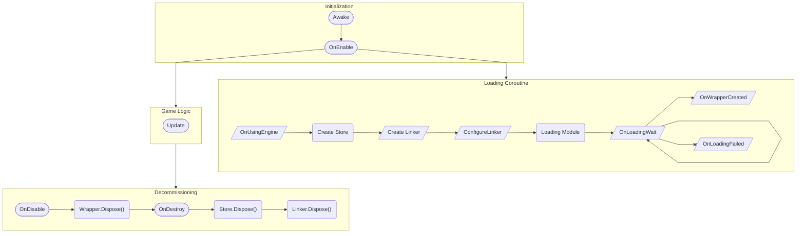

`SimpleWasmMonoBehaviour` provides an easy to use system which can load a WASM module and execute code in it, all from within a standard `MonoBehaviour`. For more information see [this tutorial](./../../basics/using_wasm.md).

## Life Cycle

`SimpleWasmMonoBehaviour` handles loading an asset and instantiating it (`OnEnable`), creating a Linker & Store (`Awake`), and destroying everything (`OnDestroy`). Refer to the Unity ["Order of execution for event functions"](https://docs.unity3d.com/Manual/ExecutionOrder.html) documentation for the exact order of these events. As the `SimpleWasmMonoBehaviour` is creating and destroying various WASM components, there are _callbacks_ (shown in diamonds) which your code can use to track what is being done.



## Properties

### `IWasmAsset? WasmAsset`

Get or set the [`IWasmAsset`](./iwasmasset.md) which this behaviour will create. When this is set, the asset will **not** immediately be reloaded; it is loaded in the "Loading Coroutine", which is started in `OnEnable`.

### `EngineConfig EngineConfig`

The [`EngineConfig`](./engineconfig.md) determines which `Engine` will be used to compile the WasmAsset into machine code. When this is set the asset will **not** immediately be recompiled, it is loaded in the "Loading Coroutine" which is started in `OnEnable`.

### `TWrapper Wrapper`

Get the "wrapper" code which has been created. WASM code can be invoked through this.

This property will throw an `InvalidOperationException` if it is access when the wrapper is not valid. The wrapper is only valid after `OnWrapperCreated` has been called and before `OnDisable` has been called.

## Methods

### `TWrapper? TryGetWrapper()`

Safe alternative to the [`Wrapper`](#twrapper-wrapper) property. Tries to get the wrapper and returns `null` if it is not currently valid.

```csharp
void Update()
{
    var wrapper = TryGetWrapper();
    if (wrapper.HasValue)
        wrapper.Value.CallSomething();
}
```

## Callbacks And Events

:::warning

Some Unity events are used inside the `SimpleWasmMonoBehaviour`. If you use these events you **must** override them and call the base method.

:::

For example to use the `OnEnable` event:

```csharp
protected override void OnEnable()
{
    Debug.Log("Your code here!");
    base.OnEnable();
}
```

### `Linker CreateLinker(EngineConfig config)`

This method will be called to create a new linker

### `void ConfigureLinker(Linker linker)`

This method will be called when a new `Linker` is created. Use it to define things on the linker such as functions & WASI features.

### `virtual void OnLoadingFailed()`

This method will be called if the `WasmAsset` fails to produce a [`LoadedModule`](./loadedmodule.md) for some reason.

### `void OnLoadingWait(Task loading)`

This method will be called every frame while the `WasmAsset` is loading.

:::caution

Call `loading.Wait()` to wait for the task to complete. This will **freeze the main thread**.

:::

### `void OnUsingEngine(Engine engine, IEpochHandle? epochs)`

This method will be called every time a new `Engine` has been chosen (because the [EngineConfig](#engineconfig-engineconfig) has changed). If [Epoch Interruption](./../../basics/limiting_execution/epochinterruption.md) is enabled the `epochs` object will be non-null, use it to set the epoch for this engine.

### `void OnWrapperCreated(TWrapper wrapper)`

This method will be called when a new wrapper is created, it is the very last part of the loading coroutine.
